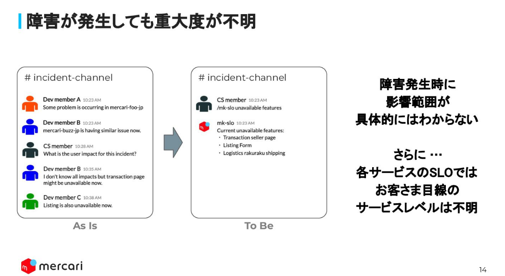

User Journey SLO = お客様目線のSLO

開発者目線のSLOは単一サービスの閉じた目標監視が主、個別のサービスがフォーカスされる

User Journey SLOは複数のサービスにまたがった目標監視

いい区切り方
---
ひとつのサービスの障害の影響範囲はわかりにくい！！！
そのサービスが死んだことで何ができなくなったのか / 何ができるのか

把握できないとこうなる↓

---
1 User Journey に対して1 SLOとする

多少の誤差があったとしても、1つのSLOになることを重視
---
クリティカルAPI(障害発生でUJがAvailableではなくなるもの)のメトリクスを用いてSLIを定義

Availability Scuj = Sa * Sb

Latency: Acuj = min(Aa, Ab)

Sa, Sb: エラー率
Aa, Ab: 目標応答時間の達成率

トライ&エラーで、コード化したら後からどんどん直していく気持ちを持つ

---

メルカリでは40のCUJがあるらしい、商品検索、出品購入発送

availableな状態を定義しておく

障害注入をして各CUJでavailableじゃなくなるAPIを発見する→それがクリティカルAPI

実行結果のメトリクスからのダッシュボードとかSLOとかモニターの作成もTerraformでコード化しておく

