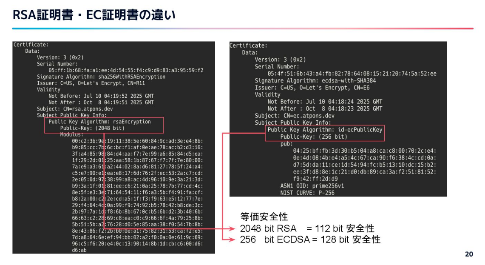

TLS大事

証明書による認証と、通信の暗号化をセットで行う

近年の利用例はどんどん増えてくる

HTTPS, HTTP/2

mTLS
クライアントとサーバの双方で証明書を用いて認証を行う
サービスメッシュとかgRPCとか、k8sのクラスタ間通信とか

---

動向として

- 自動化の加速
- 証明書有効期限の短縮化
- 暗号方式の進化

---

手動作成から自動作成が基本になった

ツールで自動化、有効期限は短く、勝手にローテーションされる

---

Let's Encryptだと期限が90日

CA/B Forum の規約で、証明書の有効期限は398日以下にすることが決まっている(2020年)
今後段階的に短く
2029年からは47日になる

オンプレでもクラウドでも自動化が求められるようになる

---

1.2 → 1.3
前方秘匿性が必ず保証(??)
ECDHEが利用されるためセッション鍵が使い捨てに

1-RTTで接続確立が可能に
- TLS 1.3ではクライアントが最初のハンドシェイクで必要な情報を送ってくる

RSA鍵交換は TLS 1.3で廃止、ECDHEが基本に

署名もRSAからECDSA/Ed25519へ

ECは短い鍵長で同等以上の強度を持つ
計算コストが低く、証明書も小さい

AWS とか Google Cloud でも発行できるようになってきている
古いデバイスの対応が課題

---

証明書更新の自動化
証明書周辺の監視
あたらしい暗号スイート・仕様への対応をやらないといけない

SREとして、TLSの変化のキャッチアップを行い、安全で持続可能な運用を支える必要がある
