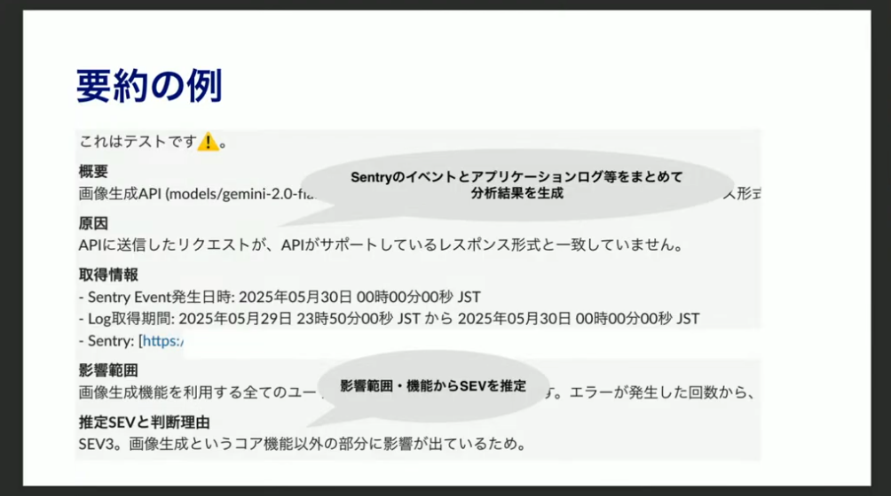

# 衛生運用をSWEに依頼したときに出来上がるもの

地上から衛生を監視・制御するクラウドネイティブなプラットフォーム

チーム目標: 衛生100機でも人手を増やさず運用できる

---

通信によってコマンドテレメトリの送受信

Grafanaで可視化

(やってることは普通のウェブと似てる)

SREのプラクティスが適用可能！

違い

日に数回、1回あたり10分くらいしか通信できない

メトリクスの種類が膨大、専門知識が必要
通信、電源、熱、姿勢、軌道

修理に行けない

---

これまで

GUIで操作して準備して通信

人間がダブルチェックしてコマンド送信

---

提携作業の自動化

DSLの型チェックを実装

とか色々

# 毎晩の負荷試験自動実行による効果

hotpepper beauty

リリース前の負荷試験をやりたい

↓大変
- 負荷試験環境のじゅんび・手動実行
- シナリオのメンテ

従来
- 専用の環境のデプロイを行う
- Gatling用のEC2インスタンスに入ってシナリオ実行

今
- GHAでワークフローを実行するとデプロイ→Gatling実行→レポート送信までやる

シナリオ
月数回実行するくらいだった
日々の機能回収にシナリオが追従できない、毎回修正してた
↓
毎晩負荷試験を行うようになったらなにが原因で動かなくなったかわかるようになった

性能が論点になる機能回収のときに負荷試験で取られる時間が3割減ったらしい

既存のシナリオがちゃんと動くことがわかっているのでシナリオ作成も楽になった

雑に実行できていい

# MCPサーバで始めたアラート整理の実験的取り組み

ちょっとずつ使っていく気持ち

アラートが来た→これなに？
影響範囲がわからん、SEV(インシデントレベル)の判断が不安
調べる余裕なし

MCPサーバを実装してAIをちょっと使っていく
実装は半日で終了した←小さく始めるのに最適

ログを取得するようなMCPサーバを実装

n8nでワークフロー実装
- Slackにアラート
- n8n軌道
- Sentry + MCPサーバで情報収集
- LLMで要約、SEV判定
- Slackに自動返信

よかったこと
- 試行錯誤しやすい！
- ログとイベントを組み合わせるから文脈が補足されてあらーとの信憑性が増す
- SEV判断のハードルを下げてくれる

課題
- あたってたか？を確かめる方法、改善サイクルが必要
- どうやってLLMにプロダクトの前提知識・業務背景を伝える？

MCPサーバがちょうどいいサイズでいい

# Difyをうまく叩かせる

社内APIとかからDifyのエンドポイントを叩きたい

セキュリティ監査にもDifyを使う

anomalyの類より役立つし、人間みたいに定型作業をさせ続けることで精度が落ちることもない

