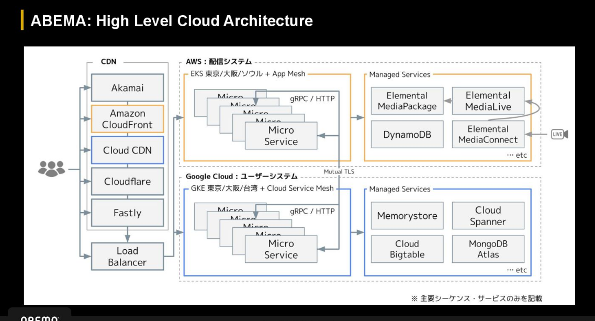
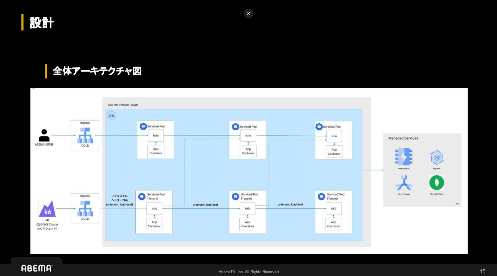
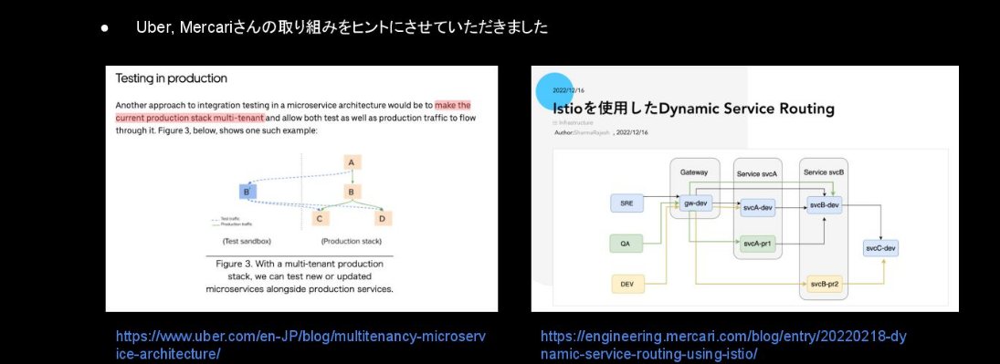
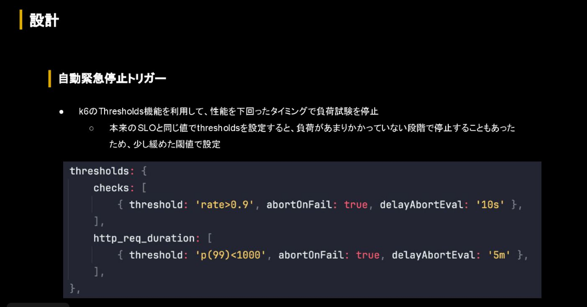
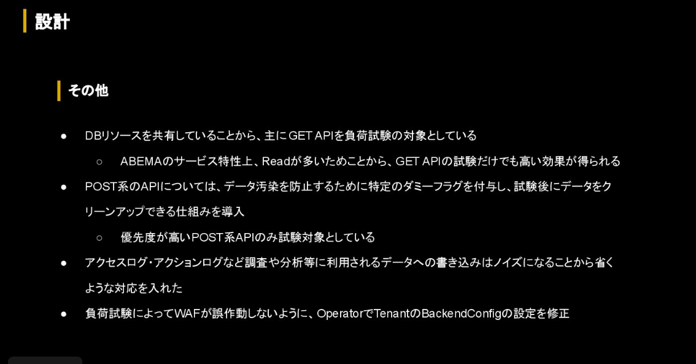

abemaについて
でかい

マルチクラウド

---

本番で負荷試験をするに至った背景

イベント配信だけでなく、平常時も多くの同説が可能であることが要件

人気番組、ニュース速報による突発的なトラフィック急増がよくある

システムがでかくて複雑
→本番と同等の環境を立てるのは非現実的

負荷試験環境は仮想環境であって、本番特有の問題を再現できないこともある

→本番でやる

---

設計

ユーザーの体験を損なわないこと

試験の影響範囲は限定的

危険を察知したら即座に手動/自動で停止

コア技術: マルチテナント化

本番クラスタ内にもうひとつアプリケーション群を置く
PodとNodeを完全に分離し、ABEMA利用者のリクエストをさばくpodのリソースを食いつぶさない

データソースは共有
- DBの規模も種類もでかく、複製がむずい

UberとかMercariが同じことをやってるらしい

Operator作ったらしい！コントローラー自作
- テナントがカスタムリソースによって構築される
- レプリカ数、CPU、メモリの変更はCR経由でオーバーライド

オリジナルのリソースを取得、nameとかのフィールドを書き換えて作成
IstioのVirtualServiceにヘッダーベースルーティングを追加
- Delegateリソースで外からルールを注入、みたいな感じ

しかも、CRの生成も自動化
試験対象のAPI一覧をもとにテナント作成時のCRを自動生成

負荷トラフィックの自動生成
- メトリクスの時系列データからk6シナリオの自動生成
- リクエストパラメータ
  - システムの変化に追従がむずい
  - 直近のアクセスログからリクエストパラメータの自動生成

自動緊急停止トリガー
- k6のthresholds機能
- 本来のSLOよりゆるいしきい値

(よさ)

(まじか)

---

合意形成

本番で試験することへの説得と理解獲得
- そもそも経営側の課題感もあった(最大同説に耐えられるかチェックしたい)
- 現状の共有
  - 複雑、普通のやり方がむずい
  - 高い
- 判断材料を渡して合意を得た
  - コストさくげんメリット
  - 大規模かつ日本国内だと事例がない、技術的価値も高い

チーム間の合意

---

成果

スパイクテスト
- 人気番組などを模したトラフィックを想定したテスト
- 事業要件までいけるのか？のスケールテスト

環境構築
- これまでは全体で数ヶ月かかってた
- 数十分になった

コスト
- 人的・金銭的に膨大なコスト
- 環境の二重管理がいらなくなった
- 負荷試験予算が85%減
- 大規模イベント時のコストを校了すると 99%さくげん見込み

---

今後

最大キャパシティを把握するための大規模な負荷試験を定常的に行いたい

リリースプロセスに入れたい
