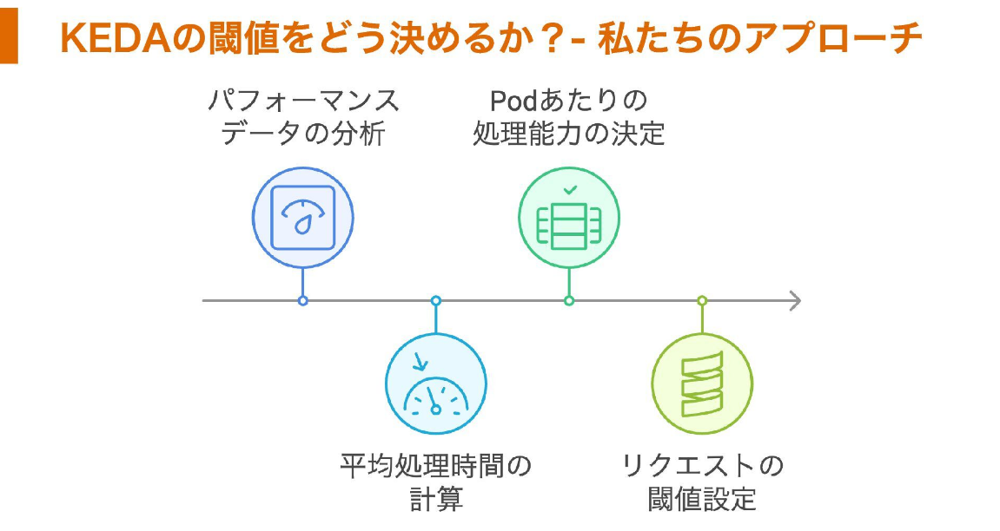

障害と課題発見
KEDA導入
データ活用最適化

(AWSに移行する話があった)
(移行時のオートスケール設計)

オートスケールはなぜ必要か
- 機会損失の防止、顧客体験の最大化
- インフラコストの最適化
- 事業成長への迅速な対応

アクセスピーク時におけるオートスケール設計
まず分析
- 対象
  - CPU使用率、メモリ使用量
  - リクエスト数との相関関係を調査
- リクエスト増加パターンを分析し、しきい値を決める

分析から
- CPU使用率がボトルネックになりそう
- オートスケールにはHPAを採用
  - KEDAにも行きたかったが、初手はまだAWSでの運用知見がなかった
    - ので、よりジェネラルなHPAを選択

HPAはリクエスト値を基準としたしきい値

↑の構成でアラートが鳴った

状況
- pod数が不足
- CPUしきい値をトリガーとしたHPAが機能してない
- メモリ不足
緊急対応
- minReplicasを大幅増加
- podのメモリ割り当てを増加

CPU使用率のメトリクスの推移が思ったよりも低かった(しきい値以下)
ただ、メモリは100%近くで推移

---

設計の改善

しきい値設定の見直し
- CPU使用率との相関に依存しないようにする
- 負荷の根本原因であるリクエスト数を直接見る
(相関関係はあくまで「現時点での傾向」として参考程度に留める)

なんで最初からKEDA選ばなかったか
- 新しい技術スタックへの技術コストの高さ

まずは実績のあるHPAで運用開始、問題が発生してから改善を検討する
→結果として最適解が見えてきた(KEDAの導入)

---

改善のアプローチ
データ活用
- アクセスパターンの分析結果を活用
- 予測可能な負荷変動への対応
技術改善アプローチ
- より適切な監視メトリクスを使う
- 柔軟なスケーリング機能を使う

スケーリング方法
静的スケーリング(cron)
- 固定的なスケジュールだと、スケジュールの細やかな調整がむずい
- 突発的なアクセス変動に対応できない

動的スケーリング
- リアルタイムでの負荷変動に柔軟対応
- より精密なリソース管理が可能

---

KEDAとは
- Kubernetes Event-driven Autoscaling
- イベントをトリガーにオートスケーリング
  - メッセージキューの長さ、DBの行数とか、"イベント"をトリガーにできる
- コスト効率の最大化
  - Podの数を自動的に0台までスケールイン可能

コンポーネント
- Operator
  - イベントソースの監視、インスタンス数調整
- Metrics Server
  - 外部メトリクスをHPAに提供、スケーリングを判断
- Scalers
  - 各イベントソースにせつぞく、現在の使用状況を取得
- CRDs
  - カスタムリソースで、アプリケーションがスケールすべきか定義

再設計
- Datadogとの連携
  - Datadog上のリクエスト数を参照
  - リクエスト数に応じてオートスケール
- しきい値算出
  - 移行前の性能試験に置けるエンドポイントに着目
  - AWS環境上の同じエンドポイントにおける処理能力からしきい値を算出

- CPU使用率でのしきい値は継続採用
  - アクセス数がしきい値に満たなくても、CPU使用率が高い場合はスケールアウト
    - 可用性
    - Datadogが死んだとき用のフェイルセーフ機能として動作
    - 監視システム単一障害点化を回避
  - 60%→45%にした
  - 早期スケールアウト実現
- メモリはしきい値に入れなかった
  - GC実行で使用率が不規則に変動
    - 信頼性に欠ける
  - メモリ集約的なアプリは事前設定するべき

フィードバックなど
- 既存の会議体にて、SREメンバー＋開発メンバーで週次で確認
- メトリクス確認、異常波形の原因特定
