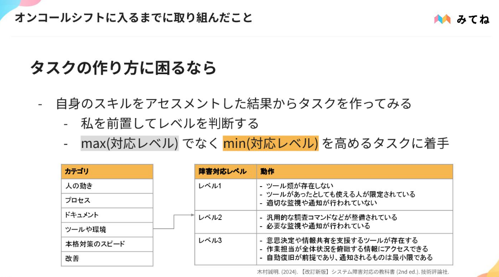
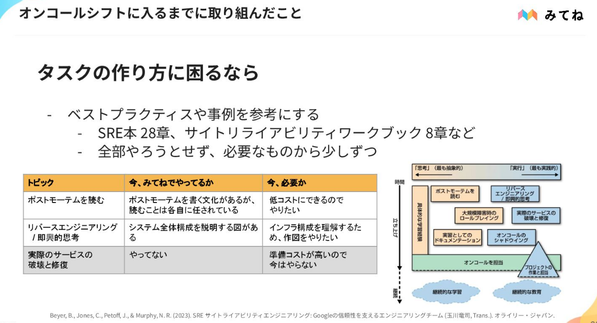

オンコール対応とは
- 問題発生時、迅速に初動対応を行うこと
  - 一次対応社を当番制で割当
  - 解決が難しい場合はインシデント対応へ
みてねの良さそうな文化
- 悩んだらとりあえずエスカレーションするカルチャー
  - 「対応できそうだけど1%くらいダメな気がする」→必ずエスカレーションする
- インシデント対応やポストモーテム作成について明文化されている

不安はあった
- 鳴ったらなにすればいいの
- 状況が変わっているとか

あなたが自信を持ってオンコールシフトに挑めることを目指す
問題を課題に分解、ペース分配しながら対処

オンコール周辺の改善へのタスク管理

